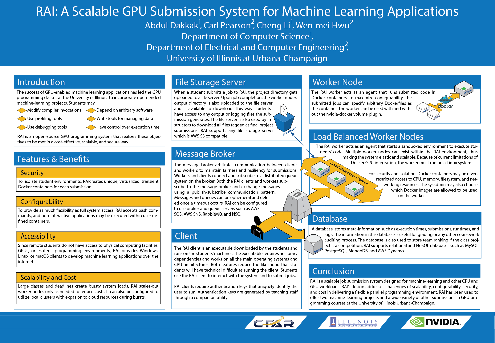

# Introduction

In a typical programming scenario, different users will need to program for different hardware systems (including GPUs) and
will have different software package dependencies. A typical solution would be for system admins to create SSH
accounts for users in different hardware servers and/or create different VMs for different users, and then install 
different software packages for different users as required. This practice creates a number of issues, such as the following:


- A lot of workload on system Admins who need to maintain those accounts and VMs. This is particularly problematic if
the number of users are large - think of an on-line education scenario where there can be thousands of students doing
the programming work, each with a slightly different programming environment (say for their final projects).
- System security issues, especially considering of sharing system resources that sit behind a firewall. Sharing systems behind a firewall with external people is particularly problematic. System Admins either have to provide VPN access to these external people (who may not necessarily have the privilage to access the internal network otherwise) or setup some special zones for these shared system resources for this particular purpose. Either way causes a significant security concern (and not to mention the extra workloads on System Admins).
- A hard-to-maintain software dependency environment, especially when users share the same server or VM. System Admins 
have to either install the union of all software packages for all users (which sometimes is impossible because of the
potentially conflicting software version dependencies), or maintain a separate virtual installation environment for
each user.
- Inefficient utilization of precious system resources - this is especially bad when users sometimes require an exclusive access
of the resources (such as GPU) whenever the users need to run their jobs. A common and easy practice is for System Admins
to allocate those resources to users with exclusive access privilage for a certain period of time (even if the users do
not necessarily need to run their jobs all the time within the period).
- A bad user experience for users - as users will have to constantly contact System Admins to make their software installment
requests and wait for (or waste) some time to get their issues resolved by System Admins. Or users will have to
install software packages in their own local environment - which most users may not be comfortable doing without System Admin
like training - not to mentioning the issues of wasting a lot of local storage for installing similar software packages among users.

RAI is a secure and distributed system designed to address some of the issues with ease-of-use in mind. RAI
allows a large group of users to do programming work (including GPU programming) 
for different hardware and software systems in a user-friendly fashion - easy for both users and for system administrators
to support such activities.


# How to Setup RAI - a User's Perspective

> As this is a User Guide, we only discuss the steps as needed from a user perspective. People interested in setting up
> the RAI system should refer to the more comprehensive [RAID service](https://github.com/rai-project/raid) and 
> [RAI client](https://github.com/rai-project/rai) development guides. In the following, we assume the RAID service
has already been setup on the desired hardware systems (such as POWER 8, POWER 9, X86/AMD etc with or without GPUs) 
by a RAI System Admin.

There are only two simple steps to setup a user's environment to use RAI. 

1.  Download a required RAI client binary (without any dependency) that is specific to the user's local machine.

The RAI client can be downloaded from the following URLs (depending on your OS and Architecture):

| Operating System | Architecture | Stable Version Link                                                             |
| ---------------- | ------------ | ------------------------------------------------------------------------------- |
| Linux            | amd64        | [URL](http://files.rai-project.com/dist/rai/stable/latest/linux-amd64.tar.gz)   |
| Linux            | armv5        | [URL](http://files.rai-project.com/dist/rai/stable/latest/linux-armv5.tar.gz)   |
| Linux            | armv6        | [URL](http://files.rai-project.com/dist/rai/stable/latest/linux-armv6.tar.gz)   |
| Linux            | armv7        | [URL](http://files.rai-project.com/dist/rai/stable/latest/linux-armv7.tar.gz)   |
| Linux            | arm64        | [URL](http://files.rai-project.com/dist/rai/stable/latest/linux-arm64.tar.gz)   |
| Linux            | ppc64        | [URL](http://files.rai-project.com/dist/rai/stable/latest/linux-ppc64.tar.gz)   |
| Linux            | ppc64le      | [URL](http://files.rai-project.com/dist/rai/stable/latest/linux-ppc64le.tar.gz) |
| OSX/Darwin       | amd64        | [URL](http://files.rai-project.com/dist/rai/stable/latest/darwin-amd64.tar.gz)  |
| Windows          | amd64        | [URL](http://files.rai-project.com/dist/rai/stable/latest/windows-amd64.tar.gz) |

After unzip / untar the RAI client file in a directory, users should see a `rai` binary in that directly. Please
remember the path to this `rai` binary (i.e., the RAI client).

As can be seen, the RAI client is a pre-compiled executable and runs on  users' machines.
The executable requires no library dependencies and works on all the main operating systems and CPU architectures.
Both features reduce the likelihood that users will have technical difficulties running the client.
Users will then use the RAI client to interact with the distributed elastic RAI system to run
the programs (more details to follow).

2. Obtain a secure RAI credential (called Profile) from the RAI System Admin so that a user can 
authenticate to the RAI system. 

> Note that please do **NOT** share your RAI credential with other users. 
> The secret key is used to authenticate you with the server.

The credential
will be given to users in a plain text form, and users need to save the credential in your 
`~/.rai_profile` (Linux/OSX) or `%HOME%/.rai_profile` (Windows -- for USERID this is `C:\Users\USERID\.rai_profile`) 
as shown below.

```yaml
profile:
  firstname: UserFirstName
  lastname: UserLastName
  username: userID
  email: userID@email.address
  access_key: XXXXXXXXXXXXXXXXXXX
  secret_key: XXXXXXXXXXXXXXXXXXXXXXXXXXXXXXXXXXXXXX
```
> Congratulations! You're all set to use RAI now.

# How to User RAI

There are three simple steps involved to user RAI.

1. Create a new project directory in the user's local machine for each programming project, including the source code & the data.
Users can edit the program locally for as long as they like. When writing the programs, the user should presume that he/she
is programming against a specific programming environment that can be described by a docker image. We will discuss more details
on this later.

2. Create a special `makefile`-like configuration file for RAI, which we call **Project Build Specification**
and it must be named as `rai_build.yml` and must exist in the same project directory as in step 1. 

The `rai_build.yml` is written as a [Yaml](http://yaml.org/) ([Spec](http://www.yaml.org/spec/1.2/spec.html)) 
file and has the following structure.

```yaml
rai:
  version: 0.2 # this is required
  image: nimbix/ubuntu-cuda-ppc64le:latest # nimbix/ubuntu-cuda-ppc64le:latest is a docker image
                                           # Users can specify any docker image found on Docker Hub
resources:
  cpu:
    architecture: ppc64le
  gpu:
    architecture: pascal
    count: 1 # tell the system that you're using a gpu
  network: false
commands:
  build:
    # The default working directory is /build in the docker image
    - echo "Building project"
    # Use CMake to generate the build files. 
    # Remember that the user's project directory is mapped to /src in the docker image
    - cmake /src
    # Run the make file to compile the project.
    - make
    # Here we break the long command into multiple lines. The Yaml
    # format supports this using a block-strip command. See
    # http://stackoverflow.com/a/21699210/3543720 for info
    - >-
      ./mybinary -i input1,input2 -o output
```

Here we assume that in the user's project directory, the user has created a `CMakeLists.txt` to generate the required
build files, and the user's target executable as specified in the `CMakeLists.txt` file is called `mybinary`,
which takes the parameters `-i input1,input2 -o outputas` to obtain whatever the users what the program
to do.

Users can modify the above `rai_build.yml` file to suite their own needs for build & run the project.

> Users can check if their rai_build.yml file is in a valid yaml format by using 
> tools such as [Yaml Validator](http://codebeautify.org/yaml-validator).
>
> Note that in some cases, users may not be able to execute certain builtin bash commands, in this scenario the current 
> workaround is to create a bash file and insert the commands users need to run in the same project directory. 
> Users can then execute the bash script within `rai_build.yml`.

3. Run the program by typing the following command in any directory where the user have access to the RAI client `rai`.

```bash
rai -p <project_folder>
```
where `project_folder` points to the user's project directory (either absolute directory or relative directory 
to the current directory.

Sometimes users may also get instructions from the RAI System Admin that a specific `queue` name should be
used for their projects. In that case, the command may become as follows:

```bash
rai --queue <rai_queue_name> -p <project_folder>
```
where `rai_queue_name` is the specified queue name from the RAI System Admin. 

> Here are a few more Options that a user can also user for `rai` as needed.
>      -c, --color         Toggle color output.
>      -d, --debug         Toggle debug mode.
>      -p, --path string   Path to the directory you wish to submit. Defaults to the current working directory. (default "current working directory")
>      -v, --verbose       Toggle verbose mode.
>
> On Windows, it might be useful to disable the colored output. You can do that by using the `-c=false` option

The user should see in his/her local machine's screen whatever messages / information he/she would normally see had he/she been
running the compilation steps as specified in `rai_build.yml` on the desired hardware system. In this example, the 
system is a POWER system (`architecture: ppc64le`) running Ubuntu with Cuda (`nimbix/ubuntu-cuda-ppc64le:latest`).
One (`count: 1`) PASCAL GPU (`architecture: pascal`) is needed and the Networking is disabled (`network: false`)
on the execution server.


Of course, the above three steps
can be iterated multiple times until users are happy with the correctness of their final programs.

> Note that in a more practical setting as decided by the RAI System Admin, the server limits the task time 
> to be certain amount of time (for example, an hour) with a maximum of certain memory (for example, 8GB)
> being used within a session. 


The following mini Demo illustrates all the above three steps. Moreover, as it can be seen, the above three steps
was iterated twice until users are happy with the final results.

[](https://asciinema.org/a/6k5e96itnqu6ekbji60c3kgy4)

As can be seen from the above demo, at the end of running `rai`, the user local screen will produce a lot of 
information related to build the project and running the project. But how would users retrieve other
artifacts (such as output files) as produced by the user program?

This is done by allowing users to download a zipped files of the entire `/build` directory from the docker image. So 
users need to save all the desired output files in that same build directory when writting his/her program. 
At the very end of the run, the RAI system will return a download link in a message similar to 
the following to allow users to download the zipped `/build` file.

> * The build folder has been uploaded to http://s3.amazonaws.com/files.rai-project.com/userdata/build-40b5d013-4497-4f64-ba3e-3aa6987c3e7c.tar.gz. 
> The data will be present for only a short duration of time.                                                                                       
> * Server has ended your request.                               

In the demo, the zipped file to be downloaded is at 
`http://s3.amazonaws.com/files.rai-project.com/userdata/build-40b5d013-4497-4f64-ba3e-3aa6987c3e7c.tar.gz`.

> Note that in a more practical setting as decided by the RAI System Admin, 
> the output `/build` directory is only available to be downloaded from the file server for a 
> short amount of time. 

# What's behind the Scene

From a user's point a view when the client runs, the local directory specified by `-p` gets uploaded to 
the server and extracted into the `/src` directory on the server. 
The server then executes the build commands from the `rai_build.yml` specification within 
the `/build` directory. 
Once the commands have been run, or there is an error, a zipped version of that `/build` directory 
is available from the server for download.

For a more detailed explanation of this, users are encouraged to check out the section of
[Execution Flow](https://github.com/rai-project/raid#execution-flow) of the RAI system
project.


# Learning by Examples

Users are strongly encouraged to learn more about RAI by following different examples. Here are a few examples users can try out.

-   [PUMPS 2018 Summer School](https://github.com/illinois-impact/pumps-ai)
-   [ECE408 Class Examples](https://github.com/illinois-impact/ece408_project)
-   [ECE408 Fall2017 Project](https://github.com/webgpu/2017fa_ece408_project)
-   [ECE508 Spring2017 MP](https://github.com/webgpu/ece508-convlayer)
-   [ECE408 Fall2016 Project](https://github.com/webgpu/2016fa_ece408project)

# Advanced Features

If users want to use their own programming environment (i.e., their own specific docker image for programming
their project), they can do so in two ways.

1. Find a docker image that satisfies their needs from [docker hub](https://hub.docker.com/), and specify
that docker image name in the `rai_build.yml` file (for example,  `image: nimbix/ubuntu-cuda-ppc64le:latest`).

2. Create a docker image by themselves. This sometimes may create a problem if users do not have
access to a desired system with docker installed (such as a POWER server). Fortunately, RAI has
also provided a solution for that. Interested users should check out the section of 
[Building Docker Images](https://github.com/rai-project/rai#building-docker-images).
from the original RAI client document.

If users want to use GPU and profile their GPU program's performance, they should check out the
section of [CUDA Profiling](https://github.com/rai-project/rai#cuda-profiling).
from the original RAI client document.

# Reporting Issues

If users find any issues of using RAI, they should check out the
section of [Reporting Issues](https://github.com/rai-project/rai#reporting-issues) 
before contacting the RAI System Admin from whom users received their
RAI credentials.

# References

-   [Dakkak, Abdul et al. “RAI: A Scalable Project Submission System for Parallel Programming Courses.” (2017).](docs/assets/rai-edupar17.pdf)
-   [](docs/assets/gtc-rai-poster.png)

# Credits

The initiator and major developer of RAI was [Abdul Dakkak](http://impact.crhc.illinois.edu/Content_Page.aspx?student_pg=Default-dakkak).

The RAI tool was originally developed at the [IMPACT Research Group](https://www.c3sr.com/) led by Prof. Wen-mei Hwu, 
and its later extension was supported by the [IBM-ILLINOIS Center of Cognitive Computing Systems Research (C3SR)](https://www.c3sr.com/).

This RAI User Guide was compiled by [Jinjun Xiong](https://researcher.watson.ibm.com/researcher/view.php?person=us-jinjun), Co-Director of
the [C3SR](https://www.c3sr.com/) Center.


